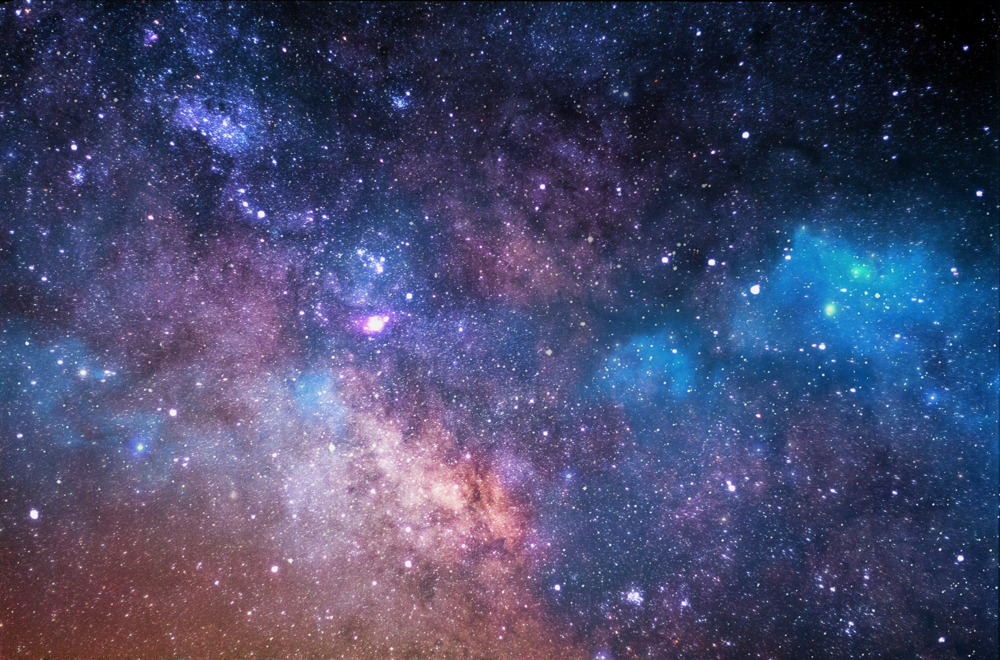
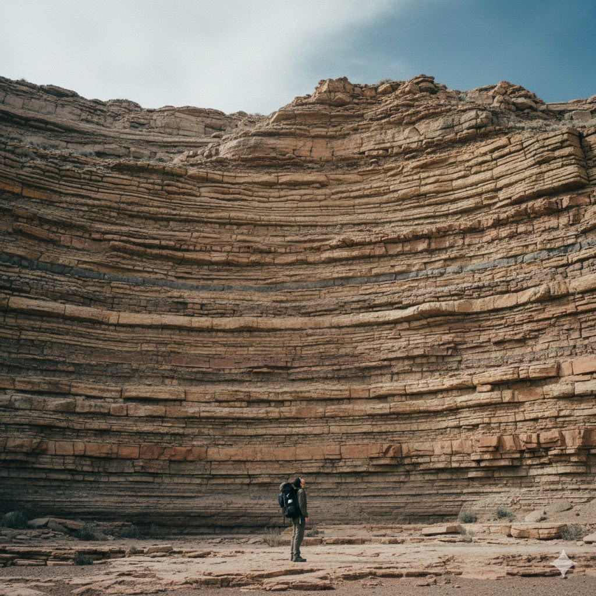
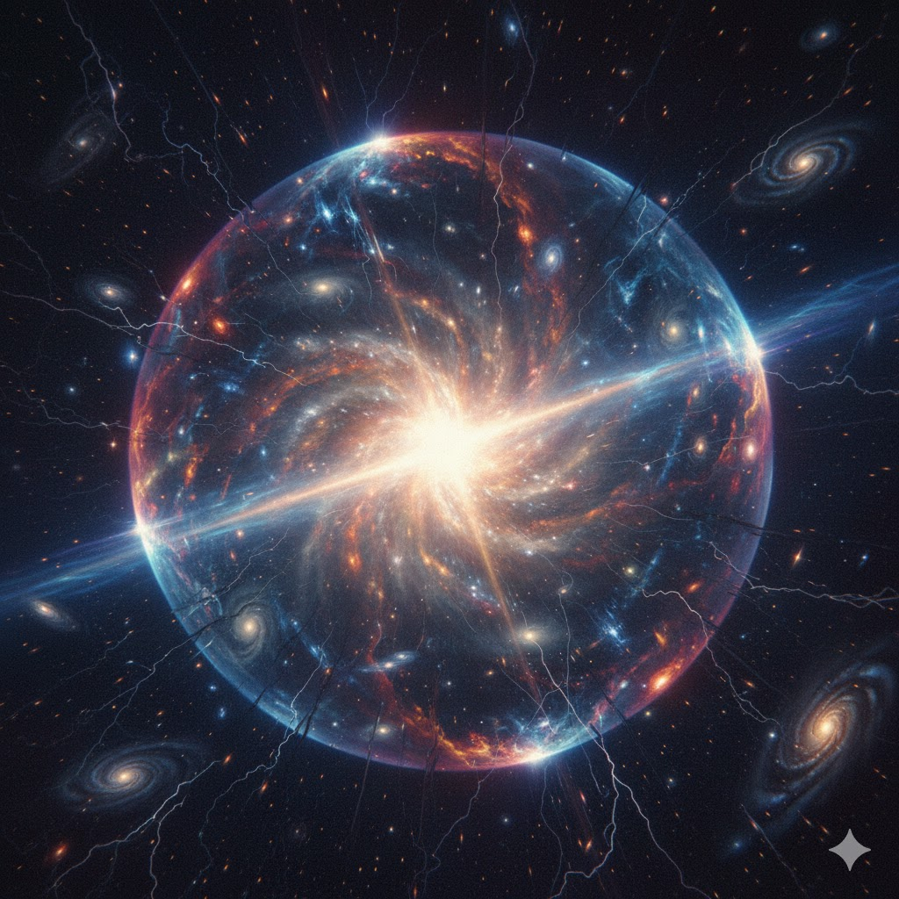
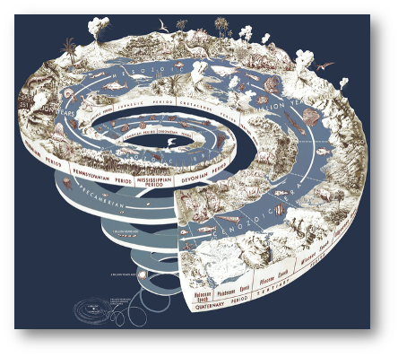
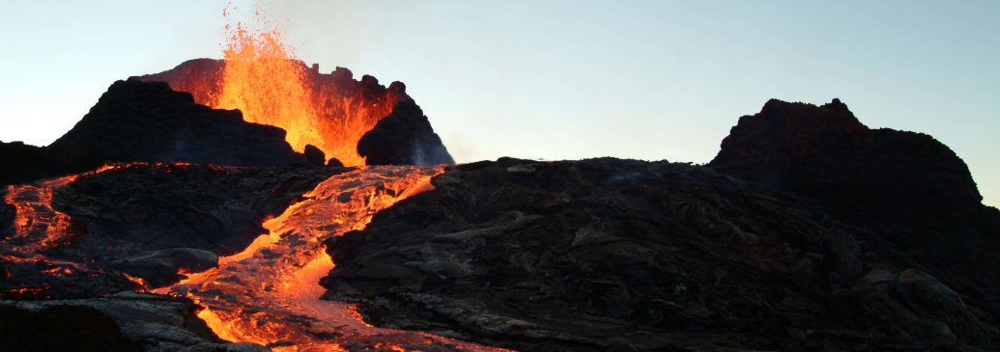
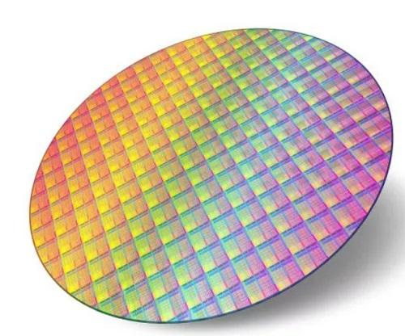
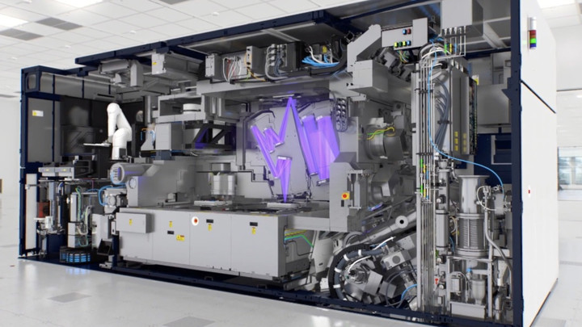
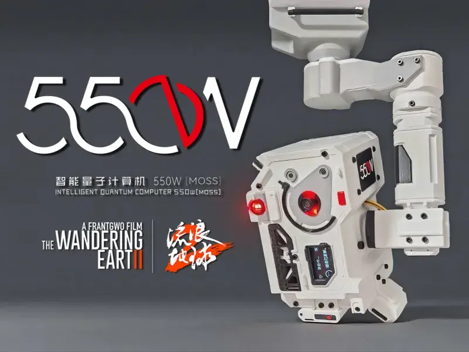

# 《大地史书》reveal.js 幻灯片框架

---

## 【封面页】

### 页面标题

**大地史书**

副标题：一块石头的故事

### 页面文字

* 家长进课堂
* 子琦子瑞的爸爸

### 图片

* 

### 动画

* 横向第一页
* `fade` 或 `zoom`，慢慢进入

---

## 一、开场仪式：矿石盲盒 = 历史的入场券

### Slide 1｜今天我来送礼物

**页面标题**

今天，我来送你们一段历史

**页面文字**

* 这是一个矿石盲盒
* 一张历史的入场券
* 让我们一起打开它
* 走进地球和人类的故事

**幻灯片备注**

> “今天我不是来讲课的，
> 我是来送你们一个‘沉甸甸’的礼物。”
> 这是一个历史的入场券，
> 我们要一起打开它，
> 并通过它走进地球和人类的故事。”

**图片**

注意：图片要放在屏幕中央

* 

---

### Slide 2｜领取矿石盲盒（仪式页）

**页面标题**

每个人，都有一块石头

**页面文字**

* 把这块石头攥在左手，
* 用体温去温暖它，
* 用右手的拇指和食指捏起来，
* 举过头顶，让我们来拍个照片纪念这个时刻！

**幻灯片备注**

> “接下来，我要问一个问题，
> 等一下这块石头会告诉你答案。”

**图片建议**

* 使用电脑（或手机）的摄像头朝向课堂，很多只双手拿着不同石头举高高，按下快门，拍摄一张照片。

---

## 二、灵魂提问：这块石头有多老？

### Slide 3｜问题页（非常关键）

**页面标题**

这块石头，有多老？

**页面文字**

- 10 岁
- 100 岁
- 比你爷爷的爷爷的爷爷……还要老吗？

**要说的话**

（原句照读）

**图片**

注意：图片要在点击鼠标后，慢慢显现，运用淡入淡出效果切换。

* 
* 

---

### Slide 4｜定调页：这是历史的大书

**页面标题**

它是历史

**页面文字**

* 比任何一个人都老
* 不是普通石头
* 是一本书的一页
* 沉积岩形成的地层，像一本厚厚的书等待人们去阅读

**幻灯片备注**

> “它不是普通的石头，
> 它是从地球史书中裁下的一颗珍宝”

**图片建议**

* 

---

## 三、第一章：宇宙写下第一行字

### Slide 5｜宇宙并非一直存在

**页面标题**

世界，并不是一开始就存在

**页面文字**

* 宇宙大爆炸：一切的开始
* 地球形成和45亿年的演化
* 你手中的石头，可能至少形成在距今 2 亿年前
* 人类在最后一小段

**幻灯片备注**

> “世界，是慢慢出现的。”
> “在这个有着 2 亿年历史的石头中，记录下了恐龙生存年代的秘密。”

**图片建议**

注意：运用图片切换的动态效果。

* 
* 

---

### Slide 6｜年轻的地球

**页面标题**

地球，正在被时间改写

**页面文字**

* 火山喷出冷却：岩浆岩
* 风化搬运沉积：沉积岩
* 高温高压变质：变质岩

* 动画强调：在时间的长河中，岩石记录了地球波澜壮阔的史诗

**幻灯片备注**

> “地球一开始，像一锅正在沸腾的汤。”
> “岩浆流淌，火山喷发，
> 后来岩浆冷却，形成了火山岩”
> 火山岩随着时间的延伸，逐渐被风化、搬运、沉积、变质，最终形成了我们今天看到的岩石。”

**图片建议**

* 

---

### Slide 7｜金句页（单独一页，非常加分）

**页面标题**

如果地球历史是一本书……

**页面文字**

> 假如地球历史是一本有 4600 页的厚书，
> 那么人类出现的那一页，
> 是最后一页的最后一段
> 我们叫他”新生代“

**图片建议**

动画：点击鼠标后，图像缓缓呈现，展示人类起源的历史。

* 

---

## 四、第二章：岩石 → 土壤 → 文明（纵向结构）

### Slide 8（父页）｜从石头到文明

**页面标题**

从岩石到文明

**页面文字**

* 岩石
* 土壤
* 农耕

**要讲的话**

* 在平顶山博物馆看到的裴李岗文化，距今约 7000 年前
* 古人开始利用岩石制作石器，狩猎采集
* 利用岩石风化形成的土壤，进行农耕，定居生活

**图片建议**

动画：自左至右，依次淡入出现以下三张图片：

* 
* 
* 

---

### Slide 8-1｜岩石风化

**页面标题**

岩石，也会改变

**页面文字**

* 风
* 雨
* 冷热
* 植物坚韧不拔的根系

**幻灯片备注**

> “石头不是永远不变的。”
> “风、雨、冷热交替，还有植物的根系，
> 都在慢慢改变石头的样子，
> 把它们逐渐变成了土壤。”

**图片建议**

* 
* 不同墓碑风化对比图（开个玩笑，一定要选一块抗风化能力强的石头立碑）

---

### Slide 8-2｜土壤形成

**页面标题**

土壤：生命的基础

**页面文字**

* 石头的碎片
* 生命的家

**幻灯片备注**

> “土壤，是会长生命的石头。”
> 粮食、蔬菜、水果，
> 都生长在土壤里，
> 土壤是人类文明的基础。”
> 地下还有已经在地球上生活了数十亿年的微生物，
> 它们帮助分解有机物，循环养分，
> 维持土壤的健康。”

**图片建议**

* 

---

### Slide 9｜喻家山就在身边

**页面标题**

你们每天看到的山

**页面文字**

> 也在写历史

**幻灯片备注**

> “历史不在课本里，
> 就在你们每天经过的地方。”
> 在喻家山上，砾岩、砂岩、土壤，
> 他们来自于不同的年代，
> 记录了不同的历史，
> 但又在这个时代交汇在一起，
> 成为了我们周末休闲时看到的风景。”

**图片建议**

* 喻家山南北坡

* 

---

### Slide 8-3｜文明

**页面标题**

历史开始加速

**页面文字**

* 农耕文明
* 工业文明
* 信息文明

**图片建议**

---

## 五、第三章：从石英到芯片

### Slide 10｜普通的石英

**页面标题**

石英：很普通的石头

**页面文字**

* 沙子：满世界都是
* 石英：硅和氧的结合体，是所有岩石中最抗风化的矿物（没有之一）
* 晶圆：岩石开始变聪明的第一步

**图片建议**

注意：作为图片的背景。

* 

---

### Slide 11｜沙子变聪明

**页面标题**

芯片：会思考的沙子

**页面文字**

* 石英 → 半导体
* 芯片 → 人工智能

**幻灯片备注**

> “你电脑、手表、手机、iPad 等等里最聪明的部分，
> 来自地球里最普通的东西。”
> 这个东西形成在地球上数十亿年，
> 它一直在抵御风化的侵蚀，
> 直到有一天，文明高度发达的人类把它变成了芯片，
> 让它变得聪明起来。”
> 成为 AI 改变世界的基石。”

**图片建议**

* 

---

### Slide 12｜光刻机（点到为止）

**页面标题**

人类，把石头变成新时代的工具

**页面文字**

* 过去，先民用石头制造斧子、凿子和箭头
* 现在，我们用激光雕刻大规模的集成电路

* 文明发展了一万年，人们依然离不开石头！

**幻灯片备注**

* 【芯片放大几万倍，你会看到什么？】 https://www.bilibili.com/video/BV17F4m1T7M2/?share_source=copy_web&vd_source=d345aeeaedba2347709dc8ca7b1b5cb1

**图片建议**

* 

---

## 六、AI：计算的力量

### Slide 13｜AI 的今天

**页面标题**

人工智能正在学习

**页面文字**

* 速度越来越快

**图片建议**

* 年初的宇树机器人还只能丢手绢
* 年底的宇树机器人已经可以翻筋斗了

---

### Slide 14｜量子制霸

**页面标题**

量子计算：算力的跃迁

**页面文字**

* 经典计算：就像用石器切肉
* 量子计算：就想用机器生产

**幻灯片备注**

> 一台量子计算机提供的算力，已经超过了地球上所有经典计算机的总和。
> 未来，量子计算机和 AI 结合，可能会带来算力的巨大跃迁，
> 世界变化会更快更剧烈。”
> 量子计算采集世界上所有可能的状态，
> 一次性计算所有可能的结果，
> 大大加快了 AI 学习和决策的速度。”

**图片建议**

* 

---

### Slide 15｜关键提醒页

**页面标题**

算力越强，责任越大

**页面文字**

> 算力越强，
> 越需要知道用来做什么

**图片建议**

* 人 + 机器的对比剪影

---

## 七、第四章：人在历史中的位置

### Slide 16｜我们在历史中

**页面标题**

我们是谁？

**页面文字**

> 历史的读者
> 也是作者

**图片建议**

* 人类时间线

---

### Slide 17｜对比页

**页面标题**

不同的时代，不同的命运

**页面文字**

* 战争年代：小朋友背负起抵抗外辱的使命，一去不回！
* 和平年代：同学们安心读书学习，创造更美好的世界和未来！

**图片建议**

* 英烈纪念碑（娃娃兵）

---

### Slide 18｜责任与未来

**页面标题**

未来，需要你们

**页面文字**

* 学习
* 思考
* 创造

**图片建议**

* AI生成：写一个孩子们在实验室或科技馆探索，极富科幻感的场景的提示词。

---

## 八、终章仪式：走向世界

### Slide 19｜最佳参与奖

**页面标题**

走向世界

**页面文字**

* 巴厘岛岩浆岩
* 天高地阔

**图片建议**

* 

---

## 九、结束语（最后一页）

### Slide 20｜收束页

**页面标题**

你们，也正在被写进历史

**页面文字**

> 一块石头：记得今天的这块石头
> 一段时间：了解地球和人类的历史
> 一种眼光：拥有观察世界的新视角

**图片建议**

* AI生成：星空 + 孩子背影的提示词

---

## 幻灯片动态效果的要求

### 即时响应效果

我希望在幻灯片中嵌入一个波形可视化效果，能够随着话筒声音的变化动态显示音频波形。将这个JavaScript脚本嵌入到reveal.js幻灯片中，实现这个功能。

### 幻灯片动画

在每一页幻灯片中，我希望能够添加一些动画效果，比如淡入淡出、缩放等，以增强视觉效果。

